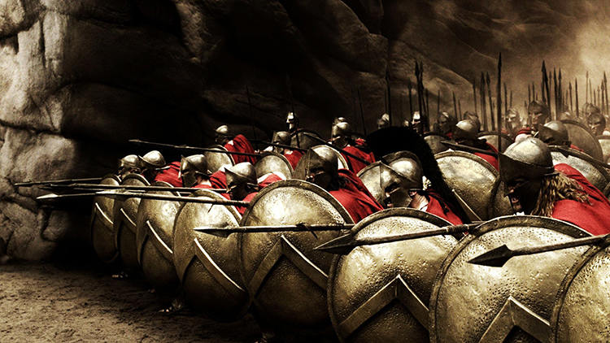

*The spartans phalanx formation.*

  The great city of Sparta was the prominent city-state during ancient Greece time. At around 900 BCE the warriors known for their military power were called the Spartans. Spartans had a great government and society which treated women high and made there men strong for war. The Spartans had great power when it came to war especially when they do the phalanx formation during the war which the formation had great offense and defense which made them impenetrable. Even though Sparta is a military type of nation, it helped them win multiple wars against other nations.
  
  
   The government of Sparta was based on an oligarchy type, which means the government were ruled by a group of elites and was structured by them. It consists of two hereditary of the Agiad and Eurypontid families and somehow were the descendants of Heracles the demi-god of strength also the gatekeeper of Olympus. This means somehow they were nobility and was bless by a God, who made them have higher authority than other families/citizens. The duties of the kings of Sparta was to deal with religious, judicial and military problems for Sparta there was also the chief of a priest, but they help maintain communication with the Delphian sanctuary and with Spartan politics.
  
  
  The Delphian sanctuary was a place where one can visit the Oracle of Delphi in which give prophecy to heroes. This was important to Sparta because it gave them an opportunity to be prepared for future battles/wars and get the preemptive strikes on their opponents also it helped them with their political problems also which the chief of priest utilized to their hearts contents. The Royal lessen over time and during the time after the Persian wars Kings lost the right to declare wars and were accompany in the field by two Ephors. Ephors were members of the council in Sparta they had to deal with Sparta’s problems financially and legislatively later in time they had judicial and executives problems and by time flowed they had more power than the kings of Sparta. This made the kings more like figureheads than ever.
  
  Life during classical Sparta was brutal due to it being a military state when children mothers would bathe their newborns in wine. This was to see if the child was healthy enough or not then if the baby does survive, they would be inspected by the Gerousia and if the Gerousia see that the child is unfit or has a birth defect, or is puny the baby was thrown into a chasm located in Mount Taygetos. This means Sparta only accept the strong will, and weakness will not be tolerated. Sparta’s education was intense also because when male Spartans are at the age of seven, they start their military training and enter the Agoge system.
  
  
  What the Agoge system was built to inspire and also discipline kids to make them physically robust and to teach them how important the Spartan state is to them life there for young boys there were fun but sometimes harsh for them. Fun things that they did was physical training and weapons training the boys also got to study their reading and writing and sometimes learn the art of music and dancing. However, if they were to fail to answer the questions, they were given or show any disrespect they would receive special punishments for most would be a severe punishment such as whipping or something extreme. For girls in Sparta, they did not receive any military training, but they would get their education none the less. At the age of twenty, a Spartan citizen would start their membership in one of the sysstia. A sysstia is a meal or banquet set to bring bonds together. This made it essential to Sparta because this gave the soldiers the opportunities to get to know their companions better. Those are the people whom you are going to fight, and eat together during peacetime also learn how to depend on each other when the time comes. To run for office in Sparta, you have to be thirty years or older. For being in the military Spartan men are to remain active in the reserve until the age of sixty. Also, men were encouraged to marry at the age of twenty because they could not live with their families until they hit the age of thirty where they can be reserved and not active.
  Spartan soldiers called themselves homoioi which means all of them are equal, and no soldier is above one another or higher ranking. Which made the phalanx possible to do and make hoplite warfare possible for the Spartans. Whenever a Spartan man went to war, his wife would be the one who brings them his hoplon (shield) and say these words “With this or upon this” which means Spartans can only return to Sparta victorious with the shield in their hand or dead carry upon the shield.  Even though men could not see their family until the age of thirty, they would sometimes sneak out at night and rendezvous with them in secret and would return before daylight. 
  
  
  The role of women in Sparta was unique in a certain way. Unlike in Athens where women get married at the age of twelve or thirteen. Sparta women would marry in their early twenties. The reason for this is because Spartan laws forbade the marriage of girls until they were in their early twenties because they want to ensure the birth of healthy children also lessen the effects of hazards of health damage associated with pregnancy for women. Women were fed the same as men, but they were confined to their father's house unlike women in Athens, but Spartan women get to exercise and get to compete in sports. Women who became wives in Sparta practice in the art of wife sharing which means men who are childless and doesn’t have a wife can have sexual intercourse with their friends wife and make them bear your children you had together. Women also had the best education they can receive and also inherit their father's fortune if they do not any other siblings. This made women have more freedom in Sparta, unlike Athens where women were treated less than men. Queen Gorgo was the heiress to the throne and was the wife of Leonidas I. She was a dominant figure and was able to decode a warning that Spartan generals could not even decode it, Persian forces were about to invade Greece this showed how women are essential. 
  
  
  The two wars Sparta were known were the Persian Wars and the Peloponnesian wars. The Persian war was the war when Persia was trying to invade and take over Greece. The battle took place in 492 to 449 BCE. The second invasion of Persia the Spartans led by King Leonidas fought against the Persians led by Xerxes in Thermopylae, Greece. This was the battle of Thermopylae at it was during 480 BCE. The battle was 300 Spartans and thousands of other Greeks vs. over 100,000 Persians. The battle was significant because even though the Persians won that battle, it helped unify Greece and bought Athens time to set up their navy for the battle of Artemisium. King Leonidas, who lead the troops of Greece during the battle, got his prophecy told him at Delphi, and his prophecy was that he was going to die in battle because if he does not Greece would burn down in flames. Knowing that Leonidas accepted his fate because he wanted the best for Greece and show that Spartans are committed to their country and won’t let anything stop them which in doing so inspire other cities of Greece to cooperate in dealing with the Persians. This is how Sparta was important during the Persian Wars. The Peloponnesian Wars was a war between the Peloponnesian League led by Sparta and the Delian league that was led by Athens. This took place in 431 BCE- 404 BCE. The cause of this war was that Sparta was scared that Athens was getting stronger and starting making threats to Sparta and with Athens in control of the Delian League it proved that Athens is a force not to mess around with. During that, the peace treaty during 445 BCE was going to break, and war was inevitable in which Sparta has begun. The war lasted about twenty-seven years with the Spartans in victory but even though the rivalry between Athens and Sparta was brought to an end few decades later King Phillip II of Macedon conquered all of the Greece except for Sparta.
  
  
  The decline of Sparta started around 371 BCE due to Sparta suffering a massive defeat at the hands of Thebans at the Battle of Leuctra. Later the following years at 362 BCE Theban general Epaminondas led an invasion of Spartan territory who oversaw the liberation of the Messenian Helots, who had been enslaved by the Spartans for several centuries. This made Spartans least to exist but, in the end,, this shows how a great state that was military based inspired Greece and how strong they were during ancient times and how many wars they were in and how they fought in a particular formation which won them several battles. Their government was strict but efficient to keep the nation going women had roles to play and played them well, and also laws kept them in check. In a way, Sparta was a successful and famous nation during ancient Greece and without them we would not have been able to fight the Persians off or lasted that long.
 
 
 
Works Cited

The Editors of Encyclopædia Britannica. "Greco-Persian Wars." Encyclopedia Britannica Online. Encyclopedia Britannica, n.d. Web. 05 Mar.    2016.

"8 Reasons It Wasn't Easy Being Spartan." History.com. A&E Television Networks, n.d. Web. 05 Mar. 2016.

"Greco-Persian Wars: Battle of Thermopylae | HistoryNet." HistoryNet. N.p., 12 June 2006. Web. 05 Mar. 2016.

Judge, Edward H., and John W. Langdon. Connections: A World History. Upper Saddle River, NJ: Pearson Education, 2011. Print.

"Peloponnesian War." History.com. A&E Television Networks, n.d. Web. 05 Mar. 2016.

"Sparta." History.com. A&E Television Networks, n.d. Web. 05 Mar. 2016.

"Sparta Timeline." - Ancient History Encyclopedia. ANCIENT HISTORY ENCYCLOPEDIA, n.d. Web. 05 Mar. 2016.
