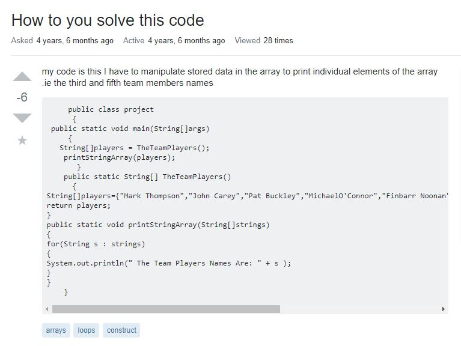

## Smart or Dumb?
  

   
When I was young I was always been told from my peers and family that I ask the dumbest questions ever. I now look back on it yeah I do ask the dumbest questions till this day. My parents always tell me think before you ask because it could come with negative consequences. So when it comes to questions think how you word your questions and see if it makes sense to the world. You can be asking a forum a question but the way you phrase the question might get you a different answer you're looking for. For example you could be asking the answer to question A but someone gave you the answer to question F. This is lead by asking a dumb question where both parties are not getting the correct information. 
 
## Do we need clarification?
 
I believe in all questions we need clarifications to see what is the problem. By knowing the problem we can figure out the steps in order to solve them. If I explain my problem to forum I to explain in best detail in order for my readers to understand the problem. If they understand it they can do the best of their abilities to solve my problem in the clearest way possible. Here in this [link](https://stackoverflow.com/questions/28921742/how-to-you-solve-this-code) we have a person asking a question in a horrible way it got downvoted because readers couldn't decipher the problem. As you can see below user asked how to solve his code but provided no details on what he wants the code to do and left the readers in a bad mood becuase they didnt know what the question/issue is. But lastly someone was able to decipher what he was trying to do and help her or she out. 
 

 
## What could be a smart question?
 
When I was exploring StackOverflow I stumbled over some questions on the forum and found this [question](https://stackoverflow.com/questions/33693787/how-to-solve-arrayindexoutofboundsexception-in-this-code) where the user ask his question in a clear and descriptive way that his audience was able to help him in an instance becuase it was a simple issue. He wrote his code down and showed his error codes and wants to figure out how to solve his ArrayOutofBounds issue. I believe he did a great job asking his questions because he provdided enough information to his audience and the audiece was able to absorb the information given to them and reply in a proffesional way. We need that becuase if information is not provided to us confusion will happen which leads to frustation and that is not approprite in the proffesional industry. 
 

 
## What can we do?
 
If there is anything to do is before you ask a question in general first evaluate the problems you are dealing with. Then after evaluating think about how your going to ask your audience how to slove it in a way they can understand and not from only your point of you. With that I believe that you won't ask a dumb question you would be asking a moderate/smart question. The more clearer you question is the less downvotes you will get in the community. We would't want the audience to get upset and rant at your grammar and have horrible experience nothing is never going to get done if that happens to always ask smart questions from now on. 
