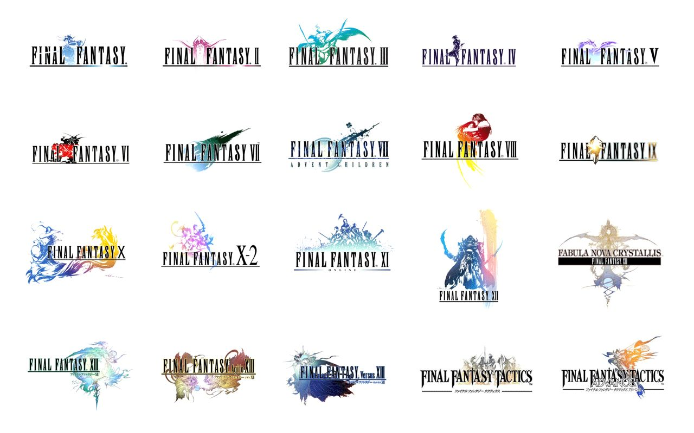
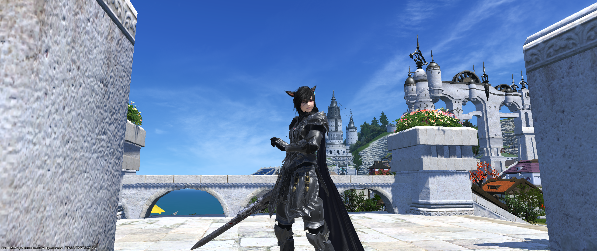

## What is software engineering to me?

Throughout my life I have always wondered what kind of software people implement in their video games. With that me and my friends were getting into the programming phase because we wanted to create our own video games. I'm really into  role playing games because I love the whole grind to level up and stats conversion theme in my video games. Especially the random number generator in order for rare loot to drop in a dungeon. Thus made me want to understand how role playing games are made and how its processes through coding so that one day I can make my own rpg.

## Steps to learning!

My first step was researching how rpgs were made and what coding is used to make it happen. When I came to research the topic I see that C++ was the most popular code to use to program games. When I got to high school I couldn't decide my future career if i wanted to become a hardware or software engineers and the degrees needed for that was to get the degree of hardware engineer or software engineer. But with those two careers they share a common degree which was computer science. In which got me into the computer science field. But as time went by I tend to like software engineering more than hardware engineering in which got me more interested into software development.   

My dream is to be able to work for Square Enix North American Branch to program games for future titles. The reason is that I'm a huge Square Enix fan and what got me into their games was the Final Fantasy series. The skills and experience I want to develop in the future is to master C++, Pascal, Java. The reason for that is many rpgs utilizes C++ for their development, although Pascal is kind of old its still great to learn from the basics. Even now im still excited to learn how to code even though C++ is really hard to learn it’s exciting to meet the challenge because im learning the requirements of my dream. Maybe in the future I get to work on projects for Final Fantasy 14 on patches or expansions and being part on that major project will be great and worth it. 
