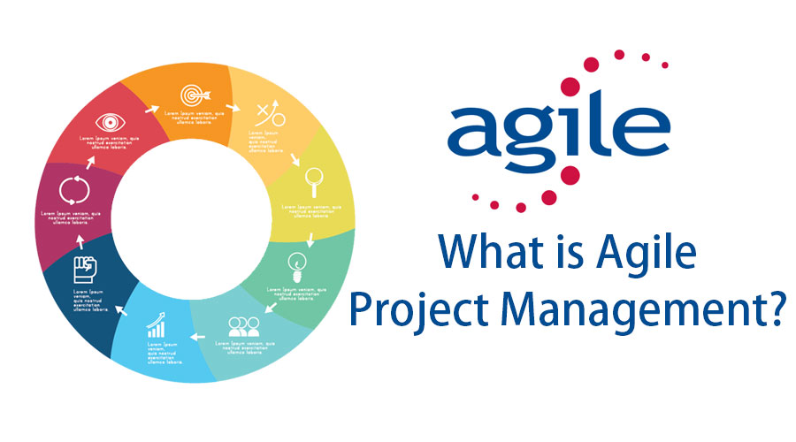

## The Process

Software Engineering has been a great deal for me during this semester because it focuses the computer science to a certain degree for me. This class taught me the importance on getting a deadline done and met in certain conditions which is necessary in today's workforce. With the necessary work ethic and communication this was good practice for. Prior to now I had not used Github or Git while working on a project since every computer science project I have done up until now has been solo.But setting milestones, assigning issues, and the use of branches with Github taught me an efficient and practical way for me and my team members to work together. With issues all of our tasks were outlined clearly and it made each teammate accountable to doing their part of the code while also allowing us to work in separate branches and make mistakes so that our code did not affect the master’s project. This class also taught me to trust in my partners abilities and to check up on then time to time to see if were on the right track. 

# Agile Project Management
Agile project management is a style of running a project.What I learned in my ICS 314 class was issue a driven project management. Issue driven project management is a management style where you make milestones with due dates, which each “issue” for each problem or hurdle that need to get done by the due date, and as you finish the issue you close it and open a new one. At certain dates we would have to present our status on our project. After presenting the project close the milestone and open a new milestone with all the remaining issues, any new ones that came up from the presentation. This is a good management style and I think that I will use it for the next big group project when I have a chance to. On which is available on Github and is easy to access to the public and most of all free.

## My Thoughts after Course 

I feel like anyone who wants to practice their HTML and CSS skills should take this class because not only that its fun and interactive it also increases your coding skills to the next level. I remember it took me a couple of hours to make one html site and with the skills I learned in this course I can make multiple html files in one day and make them look pretty. So in all if you are dedicated to Computer Science and want to work on your group project skills and such I recommend you take this course. 

