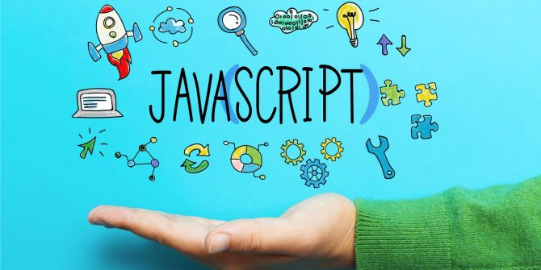

## Learning JavaScript

Learning JavaScript is a great experience for me. In a way it like learning Java again but more content. It gave me the same feeling as when I was learning C++ at the end of ICS 212. One of the first assignments of ICS 314 I had to do a module called E06 “Introduction to JavaScript”. We had to learn how JavaScript on freecodecamp.com and we had to do exercises of JavaScript it was great recapping on what I know and what I’m going to learn. It was great learning the “let” it’s a great substitute for var for when your using blocks and within the globally scope. JavaScript feels a smoother and simpler Java and thank god it is.

## Reccomendations on Stuff

I think JavaScript is a great programming to learn. I recommend that if your going to learn JavaScript you be best to learn Java. I believe its best to learn from the roots or history of something before your learning the current trend and I believe that sticks to coding. If you have experience with Java, then learning JavaScript will be like learning Java with a master key. 

## My Thoughts

What I think about athletic software engineering its very hard but challenging. When it comes to work, I really hate being rushed. Just knowing that I have a fast time limit gives me stress and that gives me test anxiety. I tend do sweat and breathe very hard when I’m stressing out and I hate it. I think WODs are necessary though it proves to me that I need more practice when it comes to programming and it shows that if I practice more often, I can improve and code faster. I also think WODs purpose is too make you code on a regular basis and with constant coding will come with benefits with solving basic problems. I think WODS will work for me but it’s going to be hard to adjust to that type of learning, but I am willing to take on the challenge.

