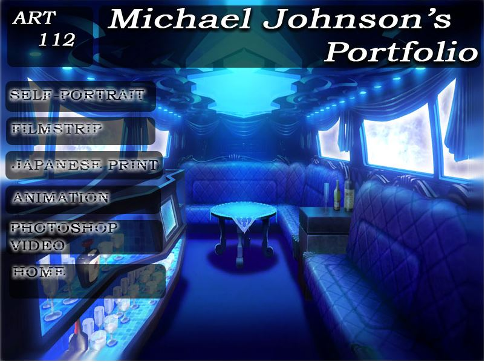

Photoshop is a program that edit pictures to make them appealing to your nature. Some people use photoshop on a regular basis in order to make memes of giphs. For my sophmore semster of college I was task to utilize photoshop to complete my assingments that are based to make an html on my final displaying my previous works. 

In this project I gained experience with full-stack web application design and associated technologies, including [MongoDB](http://mongodb.com) for database storage, the [Twitter Bootstrap](http://getbootstrap.com/) CSS Framework for the user interface, and Javascript for both client and server-side programming. 
 
Source: <a href="https://github.com/theVacay/vacay"><i class="large github icon"></i>theVacay/vacay</a>
