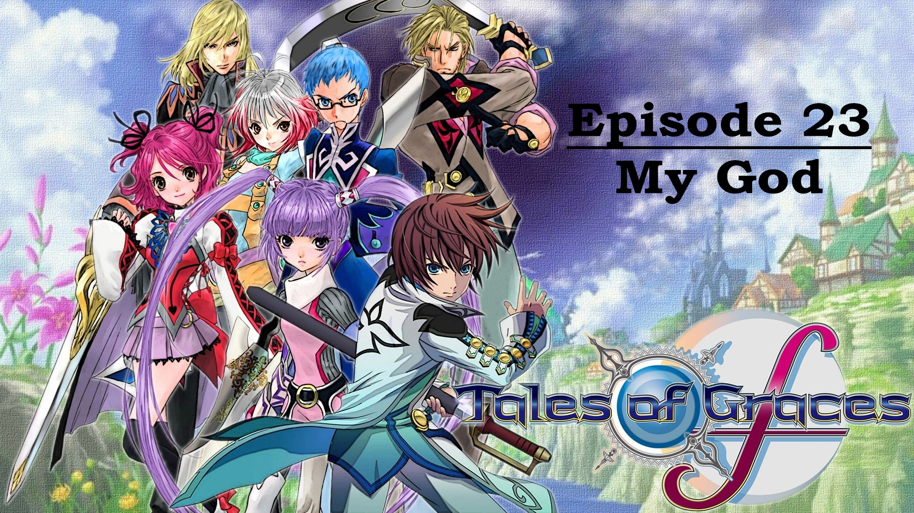

Photoshop is a program that edit pictures to make them appealing to your nature. Some people use photoshop on a regular basis in order to make memes of giphs. For my sophmore semster of college I was task to utilize photoshop to complete my assingments that are based to make an html on my final displaying my previous works. This was a fun class to take because I always wanted to learn how to photoshop some pictures to make them hilarious. 

In this project I gained experience with Adobe Photoshop 2017 as well as Adobe Premier. This was a great way of learning how to edit photos. With this I was able to to ultilize this skill in making my thumbnails for my Youtube videos for my Let's Play Channel. Here is an example right below.   
 

Here below is a download link of my Art 212 folder in a zip file please keep all files withing the folder and when you open th folder open the Final-Project html to run it.

[Link](https://drive.google.com/file/d/12-3L_CZuE10hS-V_G36m2Vz3l5I72EWG/view?usp=sharing)
