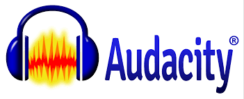

## Task

For this project I was put into a group of four students and our task was to research what the IRS does and our thoughts on what we think of it. For our work load we were to be given a sub topic of IRS and do research on it and record ourselves using Audacity and send our recordings to our group leader. It was kinda of fun doing this project because I never fully understand what the ISA really is but our information is leaked out to them on a daily basis. This is a show of invasion of privacy and to know that is legal shows that our government is corrupt in a way. My task was to research how the IRS functions and how they keep track of your funds, debts, and taxes and monitor your spending habits. 

## Hardships

The hardships of this project was to record a clean take of my voice. This is due to background noises and interruptions form my roommates. Although I had the right equipment it was not a great location I was living at the time. Also it was hard to not sound like i was reading from a script and make my voice sound legit and not like a robot. Although it was hard I love that Audacity is free and available to edit your audio tracks to minimize background noise and make it sound clean. 

## Link

Here below is a link to our group video on Youtube 
[Link](https://www.youtube.com/watch?v=gwrAP2KPJh0&list=LLtPjG5VOZEq5glokGJsuS1w&index=287&t=0s)

