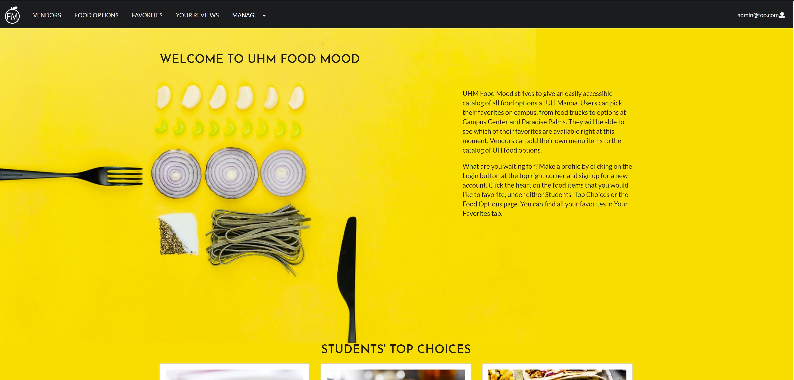

## The 411

For this project I was put into a group of three students and our task was to research was to develop a website application for the public and it was our final for ICS 314 (Software Engineering). UHM Food Mood is the name of our website and its designed to show and consolidate food options for students and staff attending University of Hawaii Manoa. With the application the designated audience can browse through food options and favorite them by selecting the heart icon. With that the audience can see their favorites in the favorites tab and see if their food is available quicker. In addition, our audience are also able to review food options and give a score between 1 - 5 (from 1 being the lowest and 5 being the highest). The average of the ratings for each food option will appear on the food option card. The audience can also sort by highest rating by clicking the “Sort by Rating” button.

## Tasks

The task that I was assigned to this project was to designed the Landing/Home Page and the User Page of our website. I was also the one to help with making the mock-ups of our site with along side my teammate Kelli. She and I made the decision to use Cards as the basis for the food options/favorites. I was to edit any mistakes we made with our website and make improvements on stuff our TA's recommend us to utilize and make minor edits as well. I would say my main contribution on this project was to finish what needed to be done and listen on feedback from my teammates and peers.  

## Link

Here below is a link to our group video on Youtube 
[Link](https://www.youtube.com/watch?v=gwrAP2KPJh0&list=LLtPjG5VOZEq5glokGJsuS1w&index=287&t=0s)

